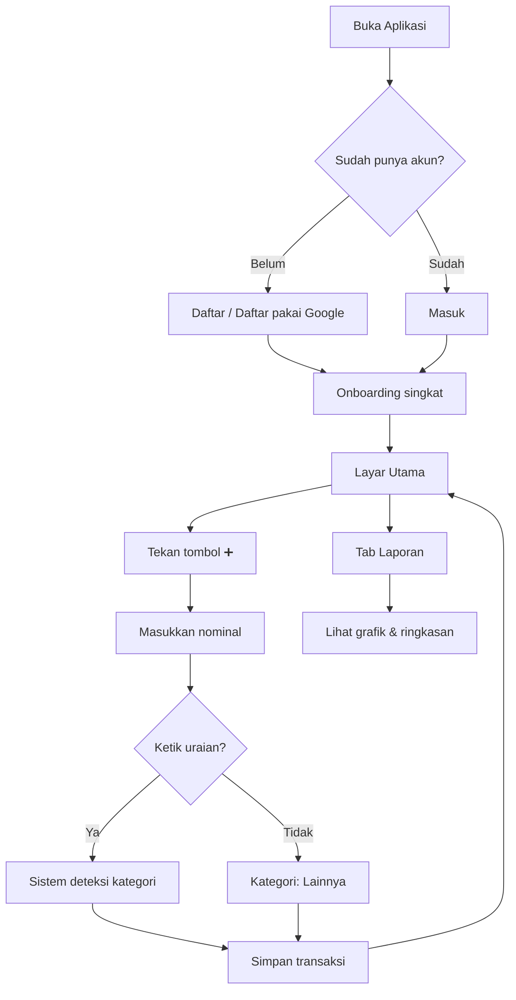
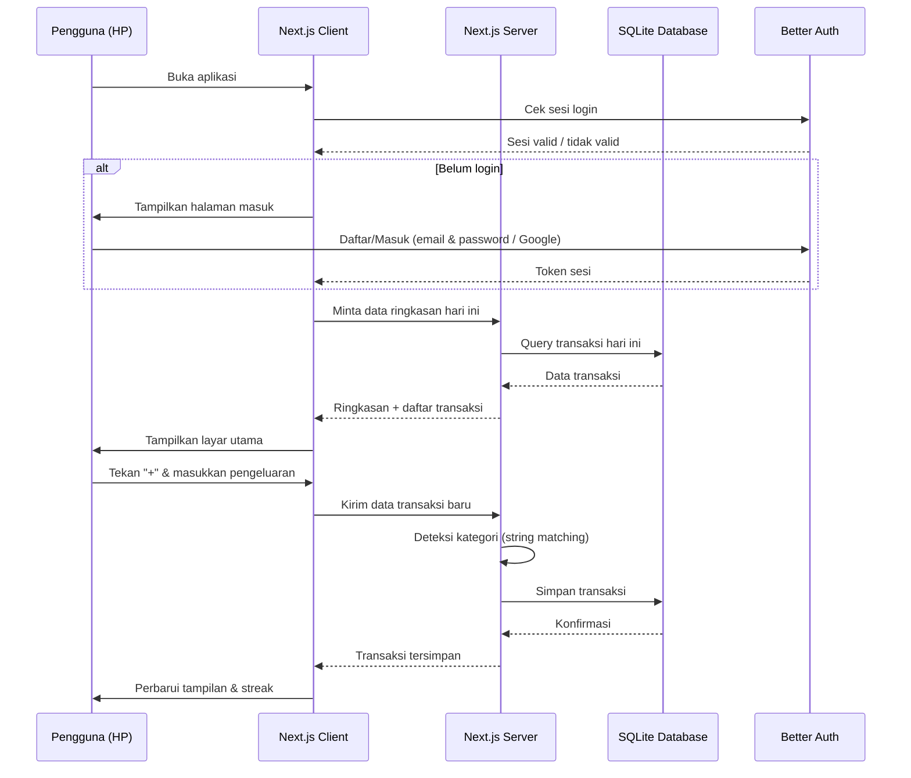
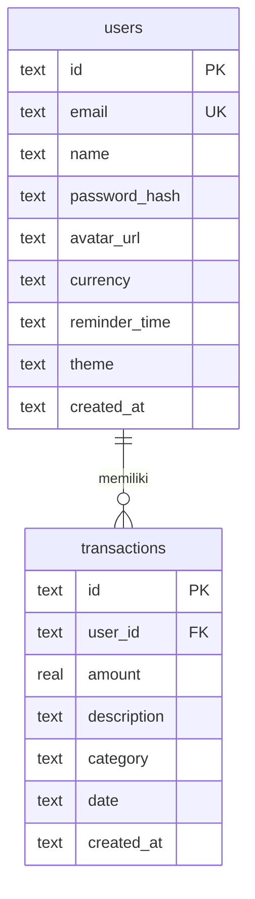

# PRD — Project Requirements Document

---

## 1. Overview

### Masalah
Pekerja kantoran sering kehilangan jejak ke mana uang mereka pergi. Gaji masuk, tapi di akhir bulan selalu bertanya-tanya "kok habis ya?". Metode catat manual seperti buku tulis atau Excel terasa ribet, membosankan, dan gampang lupa diisi. Aplikasi keuangan yang ada di pasaran terlalu kompleks dan penuh fitur yang tidak dibutuhkan — malah bikin malas buka aplikasinya.

### Tujuan
Aplikasi pencatat pengeluaran harian ini dibuat untuk satu hal: **mencatat pengeluaran secepat dan semudah mungkin**, dengan tampilan yang enak dipandang. Fokus pada kesederhanaan dan desain yang bikin betah, sehingga pengguna membentuk kebiasaan harian mencatat tanpa merasa terbebani.

---

## 2. Requirements

### Persyaratan Fungsional
1. **Pencatatan instan** — pengguna bisa mencatat pengeluaran baru dalam hitungan detik setelah membuka aplikasi, maksimal 3 langkah dari layar utama.
2. **Kategori otomatis** — sistem mendeteksi dan menyarankan kategori berdasarkan uraian pengeluaran yang diketik (contoh: "nasi goreng" → kategori Makanan).
3. **Riwayat dan grafik** — pengguna bisa melihat ringkasan pengeluaran dalam bentuk grafik mingguan/bulanan dan daftar transaksi.
4. **Akun pribadi** — tiap pengguna punya akun sendiri agar data aman dan hanya bisa diakses oleh pemiliknya.

### Persyaratan Non-Fungsional
1. **Kecepatan** — waktu muat layar utama ≤ 1,5 detik.
2. **Desain modern & minimalis** — antarmuka bersih, warna kalem, tipografi nyaman, animasi halus.
3. **Mobile-first** — dioptimalkan untuk layar ponsel (ukuran 375–428px lebar) karena pekerja kantoran lebih sering pakai ponsel untuk hal cepat.
4. **Ketersediaan** — bisa diakses 24/7 tanpa jeda.

---

## 3. Core Features

- **⚡ Catat pengeluaran cepat** — tombol "+" besar di layar utama, form pendek (nominal, uraian opsional), simpan instan.
- **🤖 Kategori otomatis** — teks uraian dikenali otomatis; kategori ditampilkan sebagai badge warna-warni (Makanan, Transport, Belanja, Hiburan, Tagihan, Lainnya).
- **📊 Grafik & laporan** — ringkasan bulanan berupa pie chart per kategori dan bar chart per minggu; total pengeluaran ditampilkan jelas.
- **🔔 Pengingat harian** — notifikasi ringan di jam yang ditentukan pengguna (default: jam 8 malam) untuk mengingatkan catat pengeluaran hari ini.
- **🔥 Streak & kebiasaan** — indikator berapa hari berturut-turut pengguna sudah mencatat; streak panjang ditampilkan dengan animasi kecil sebagai motivasi.
- **📝 Riwayat transaksi** — daftar kronologis dengan filter per kategori dan rentang tanggal; bisa diedit atau dihapus.
- **👤 Profil & preferensi** — atur nama, mata uang, jam pengingat, tema (terang/gelap).

---

## 4. User Flow

### Alur Pertama Kali Membuka Aplikasi
1. **Daftar / Masuk**
   - Pengguna baru mendaftar dengan email + kata sandi, atau langsung pakai akun Google.
   - Pengguna lama masuk ke akun yang sudah ada.
2. **Onboarding Singkat (opsional, bisa dilewati)**
   - 2-3 layar geser yang memperkenalkan fitur utama.
   - Atur jam pengingat harian.
3. **Masuk ke Layar Utama**
   - Langsung melihat ringkasan hari ini: total pengeluaran, daftar transaksi terakhir, dan tombol "+" yang menonjol.

### Alur Harian (Pengguna Kembali)
1. **Buka aplikasi** → lihat layar utama dengan ringkasan.
2. **Catat pengeluaran** → tekan tombol "+" → masukkan nominal → (opsional) ketik uraian singkat → sistem otomatis mendeteksi kategori → simpan.
3. **Lihat ringkasan** → gulir ke bawah untuk melihat transaksi hari ini atau buka tab "Laporan" untuk grafik bulanan.
4. **Terima pengingat malam** → jika belum mencatat, notifikasi muncul → tekan notifikasi langsung ke form pencatatan.

---

## 5. Architecture

Aplikasi dibangun sebagai aplikasi web full-stack yang dioptimalkan untuk ponsel. Arsitektur terdiri dari tiga lapisan utama:

| Lapisan | Fungsi | Komponen |
|---------|--------|----------|
| **Klien (Browser/HP)** | Tampilan dan interaksi pengguna | Next.js, Tailwind CSS, shadcn/ui |
| **Server** | Logika bisnis, autentikasi, API | Next.js API Routes / Server Actions |
| **Database** | Penyimpanan data | SQLite (via Drizzle ORM) |

---

## 6. Database Schema

### Tabel `users`
| Kolom | Tipe | Kegunaan |
|-------|------|----------|
| `id` | text (UUID) | ID unik pengguna |
| `email` | text | Email untuk login |
| `name` | text | Nama tampilan pengguna |
| `password_hash` | text (nullable) | Hash kata sandi (null jika pakai Google) |
| `avatar_url` | text (nullable) | URL foto profil |
| `currency` | text (default: 'IDR') | Mata uang pilihan |
| `reminder_time` | text (default: '20:00') | Jam pengingat harian |
| `theme` | text (default: 'light') | Preferensi tema |
| `created_at` | text (ISO date) | Tanggal pendaftaran |

### Tabel `transactions`
| Kolom | Tipe | Kegunaan |
|-------|------|----------|
| `id` | text (UUID) | ID unik transaksi |
| `user_id` | text | ID pengguna pemilik |
| `amount` | real | Nominal pengeluaran |
| `description` | text (nullable) | Uraian singkat |
| `category` | text | Kategori (hasil deteksi atau 'Lainnya') |
| `date` | text (ISO date) | Tanggal transaksi |
| `created_at` | text (ISO date) | Waktu pencatatan |

---

## 7. Tech Stack

| Komponen | Teknologi | Alasan |
|----------|-----------|--------|
| **Kerangka web** | Next.js 14+ | Full-stack dengan Server Actions, routing simpel, performa tinggi |
| **UI & gaya** | Tailwind CSS + shadcn/ui | Komponen siap pakai yang cantik, mudah dikustom, mobile-first |
| **Autentikasi** | Better Auth | Library autentikasi modern, dukungan Google OAuth, sesi aman |
| **ORM & database** | Drizzle ORM + SQLite | Query aman secara tipe, setup ringan tanpa server database terpisah, cocok untuk skala personal |
| **Hosting** | Vercel (Next.js) | Deploy gratis dan mudah, custom domain, performa global |
| **PWA (opsional)** | next-pwa | Agar bisa dipasang di layar utama HP seperti aplikasi native |

---

Dokumen PRD ini sudah mencakup gambaran lengkap aplikasi pencatat pengeluaran harian — dari masalah yang diatasi, fitur inti, alur pengguna, arsitektur, struktur database, hingga pilihan teknologi yang dipakai. Siap dijadikan acuan untuk tahap pengembangan selanjutnya.